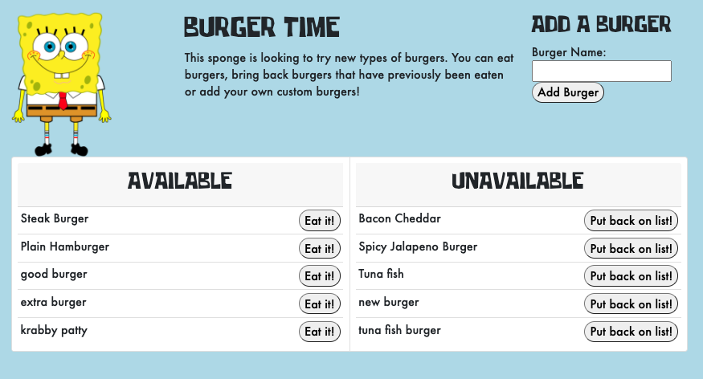

# its-burger-time

## Deployed

Check out the deployed web app here 👉 [Its Burger Time](https://its-burger-time2020.herokuapp.com)

## Description

This is a burger logging full stack application that utilizes Node.js, SQL, Express and handlebars, Javascript, CSS and more!

## Usage

Help out a friendly sponge that is looking to try new types of burgers. You can eat burgers, bring back burgers that have previously been eaten or add your own custom burgers!

## Contributions

Submit a pull request.

## Questions

https://github.com/g-strick
